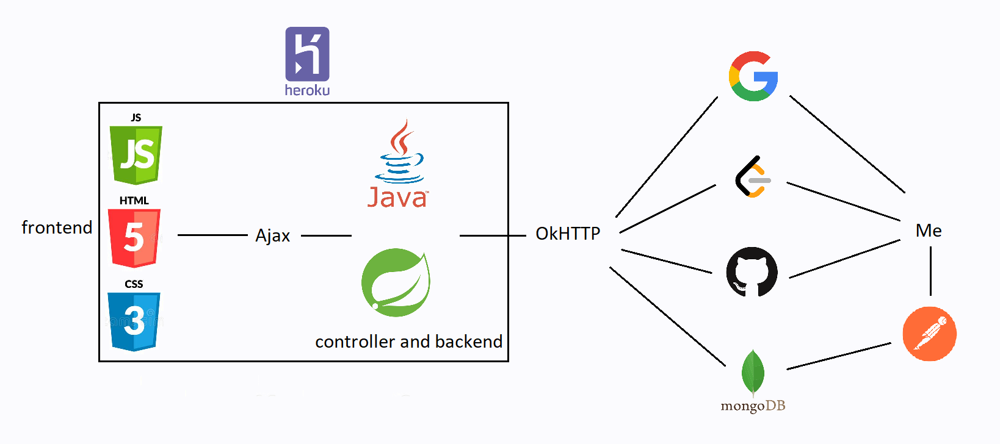
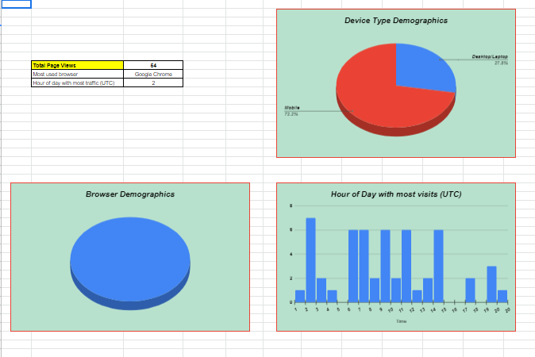

# Welcome to my web-portal project!

I have developed this webpage in an effort to have more control over what and how I choose to display than LinkedIn. While this could have been developed solely as a frontend project, backend integration ensures that I can quickly make changes to my information on the go without having to go into the code and rewrite stuff again.

# Project Infrastructure

A representaion of the project infrastructure can be shown as follows
<picture>
  <source media="(prefers-color-scheme: dark)" srcset="src/main/webapp/assets/Project_Layout_Dark.png">
  <source media="(prefers-color-scheme: light)" srcset="src/main/webapp/assets/Project_Layout_Light.png">
  
</picture>

The frontend is served by HTML, JSP, CSS and JavaScript. All information is fetched via Ajax calls from the frontend to the controller classes defined in Java. The backend uses OkHTTP3 client to form the formal requests and forward them to different databases and servers to fetch live information. Information receieved is passed back to the frontend layer to be parsed and displayed.

Non-statistical information is fetched from MongoDB Atlas servers in realtime. This adds the advantage of flexibility because information displayed in the webpage can be changed directly by updating information in the database via a simple API call.

# Information collected

While opening the webpage, the following information is automatically collected and stored for analysis, statistical and debugging purposes :-
- UTC Time Stamp
- Browser Client
- Device screen width
- Device screen height

Visitor browser information, and visitor communications are stored directly in Google Sheets in my drive via API calls through [SheetsDB](https://sheetdb.io/apis).

Post storgae, Google Apps Scripts and Google Sheets process the information and displays it in a meaningful way. The stored information helps me get important insights like webpage traffic, frequency distribution of footfall vs time of day, and device and browser types commonly used to access my webpage. A glance into the generated outputs is as follows

All stored/processed information is available for viewing [here](https://docs.google.com/spreadsheets/d/1ZsfrKS97d97JoJ7m96PUkEFEkCCwCx7zLvbSURfBAiw/edit#gid=369051520)

# Credits

All the technologies used are beautifully documented and explained in the interent, from where I have learnt the implementations. YouTube and StackOverflow are obligatory mentions. Special mentions are as follows:-
- LeetCode accuracy and completion progress wheels inspired by [https://codepen.io/sheikzm/pen/BeyXpz](https://codepen.io/sheikzm/pen/BeyXpz)
- Contact form inspired by [https://codepen.io/lina994/pen/zYdbwBP](https://codepen.io/lina994/pen/zYdbwBP)
- Profile photo hexagonal crop inspired by [https://codeconvey.com/css-hexagon-image-with-border/](https://codeconvey.com/css-hexagon-image-with-border/)
- Loading page inspired by [https://codepen.io/Curlmuhi/pen/ExKWXKO](https://codepen.io/Curlmuhi/pen/ExKWXKO)